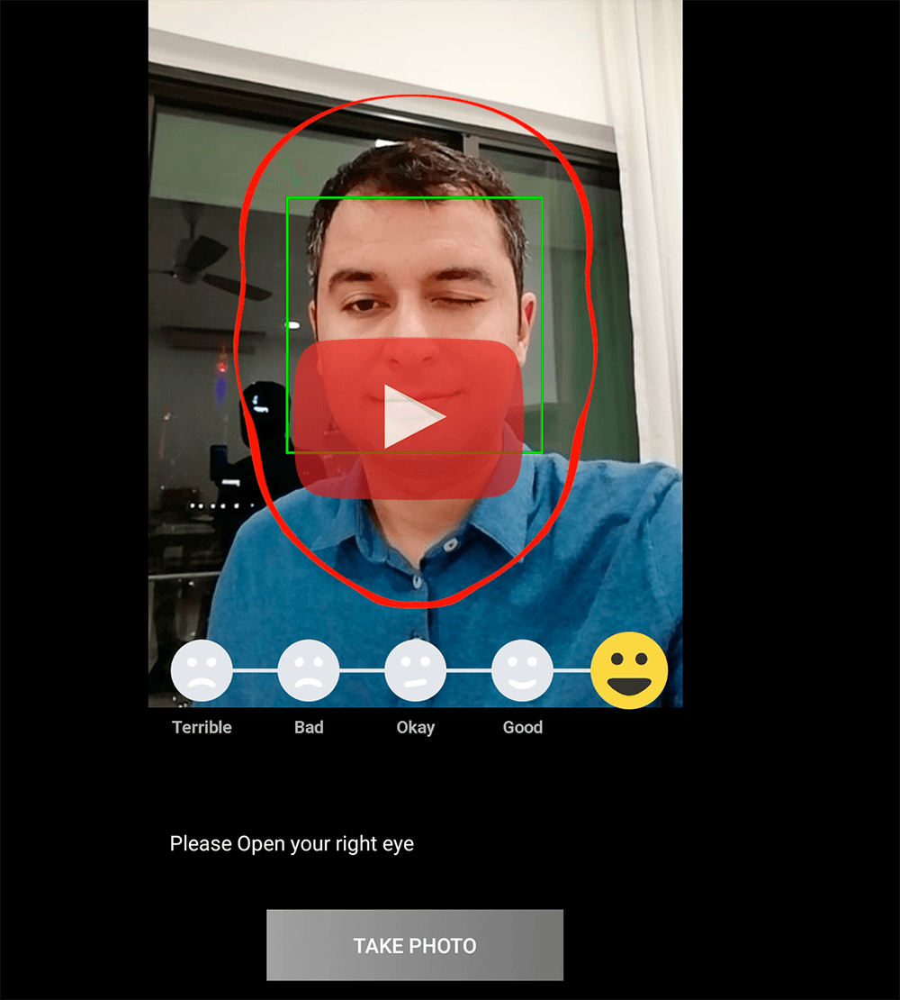

# Android MLKit Sample (Google machine learning - Face Detection)  
  

 
  

  
   
This repository contains a simple Android application that implements Google firebase MLKit(Machine learning kit) to face detection.  
To avoid complication i used JAVA 8 and not implemented any architecture pattern (MVP or MVVM).  
Otherwise you can get a MVVM/Kotlin and LiveData simple project with follow my other sample project.  
  
<a href="https://github.com/ateymoori/mulight">Mulight, a simple MVVM/Kotlin/LiveData/RX pattern in Android</a>  
  
[Sample APK file](files/face_detection.apk?raw=true)
  
  
Version 1.0.5 *(Aug 6, 2019 )*  
----------------------------  
  
First commit.   
 * Add: Detect facial expression added.
  
Version 1.0.4 *(July 21, 2019 )*  
----------------------------  
  
First commit.   
 * Add: Add monitor eye opening status for each eye.  
 * Fix: Output image position fixed.  
 * Add: Save image in internal storage to avoid get extra permission.  
  
   
Version 1.0.3 *(July 21, 2019 )*  
----------------------------  
  
First commit.   
 * Add: Detect Face located in frame.   
 * Add: Capture image added.  
 * Add: ImageViewer activity added.  
  
   
Version 1.0.2 *(July 20, 2019 )*  
----------------------------  
  
First commit.   
 * Add: Get position of detected face and compare with Face Frame position.  
 * Add: Detect face located in true position and send the status with interfaces to Activity.  
  
   
Version 1.0.1 *(July 20, 2019 )*  
----------------------------  
  
First commit.   
 * Add: MainActivity with detect faces added.  
 * Add: FaceDetection Processor added.  
  
   
Version 1.0.0 *(July 19, 2019 )*  
----------------------------  
  
First commit.   
 * Add: Firebase ML Vision added  
  
----------------------------  
AmirHossein Teymoori  
teymoori.net@gmail.com